.. highlight:: none

7. Build XenServer Host
========================================

This page is not based on the OpenStack Installation Guide.

1. In this guide I am using a server with a small RAID-1 for the OS, and a large RAID-10 for the VMs.
2. Boot with XenServer 6.5 DVD.
3. Set keyboard, agree to terms, etc.
4. Set the installation destination to sda.
5. Set VM storage to only sdb, and enable thin provisioning:

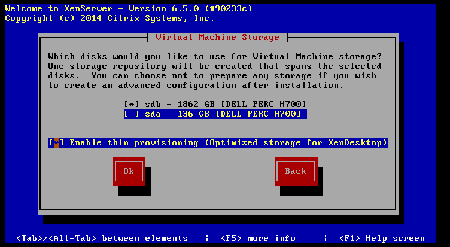
6. Select local media as the installation source.
7. Do not install any supplemental packs.
8. Skip verification of the installation media.
9. Set a good ``*XENSERVER_ROOT*`` password. Use a password which you don't mind being plain-text readable to anyone who has root access to this system.
10. Set the management network interface to use eth1 and configure the IPv4 addresses:

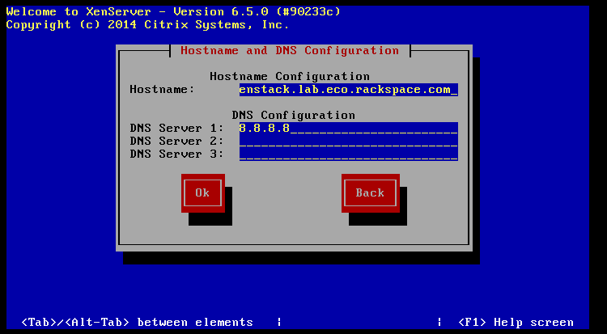
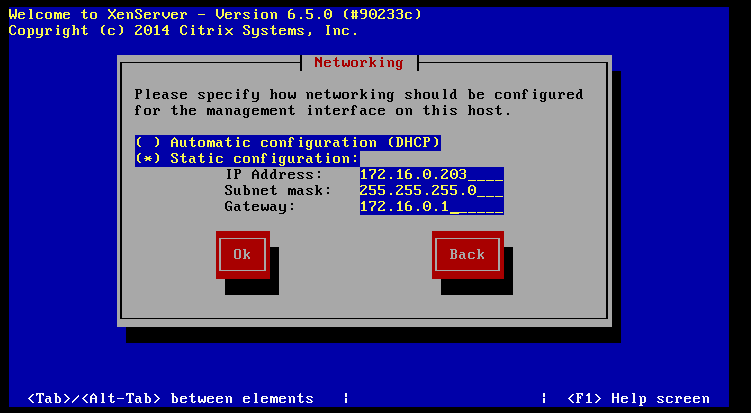
11. Set an appropriate timezone.
12. Configure the server to use NTP, and set the server address as the controller's IP:

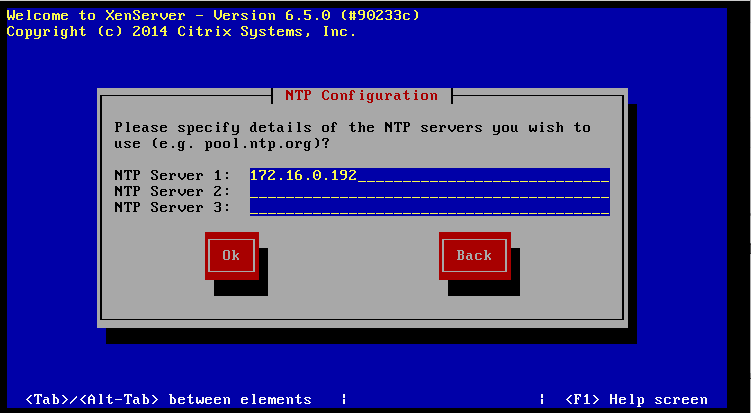
13. Start the installation.
14. Reboot the server to start XenServer. The first boot will take a very long time. It will appear to hang a couple of times, but wait for it to reach the user interface.

15. On a Windows workstation, go to http://xenserver.org/open-source-virtualization-download.html
16. Download XenCenter Windows Management Console, and install it.
17. Download XenServer 6.5 SP1 (under Service Packs), and keep it safe in a directory.
18. Download all of the public hotfixes for XenServer 6.5 SP1, and also keep them safe in a directory.

19. Launch XenCenter, and click add new server:

.. image:: assets/page07-add-new-server.png
20. Enter the address and credentials of the XenServer:

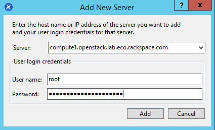
21. Enable the option to remember the connection, and click OK.
22. Open up the SP1 zip file you downloaded, and double-click the XenServer Update File inside:

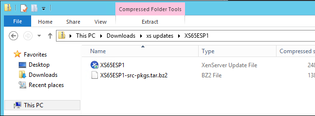
23. This will open the Install Update wizard. Click Next:

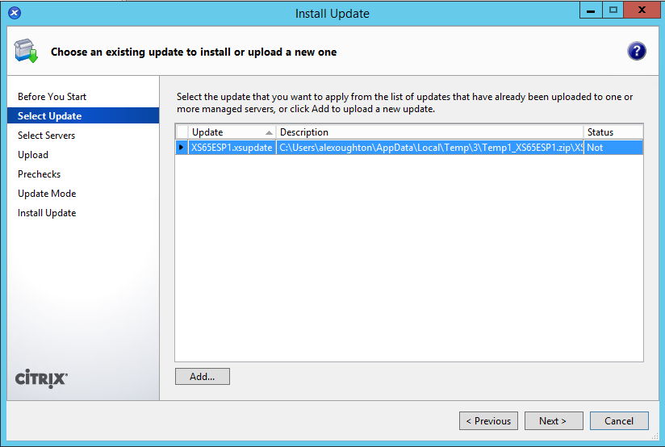
24. Select our one server, and click next:

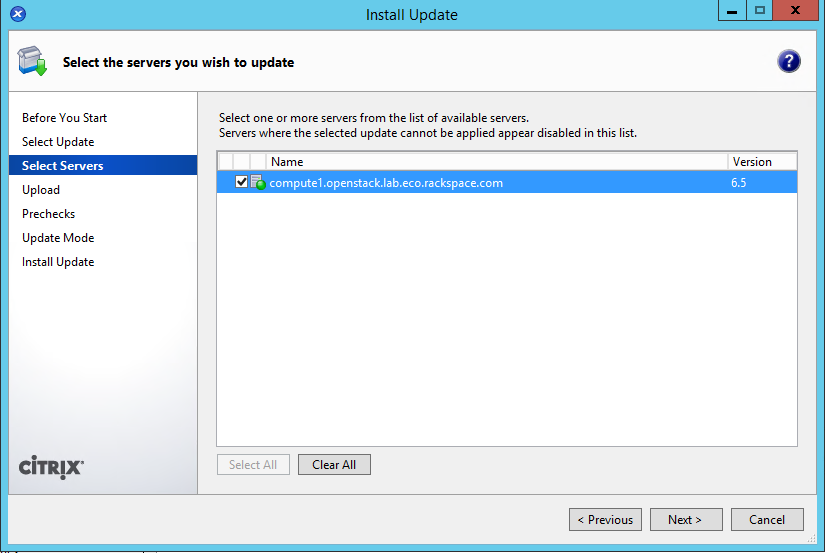
25. XenCenter will upload the update to the server. Click next when done:

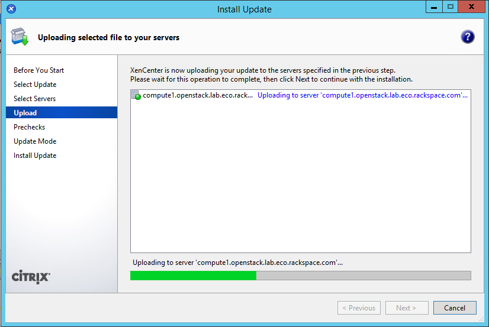
26. XenCenter will run some checks. Click next when done:

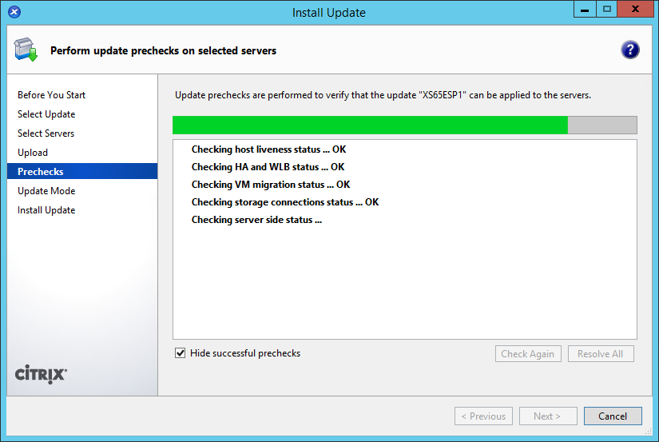
26. Select "Allow XenCenter to carry out the post-update tasks", and then click on "Install Update":

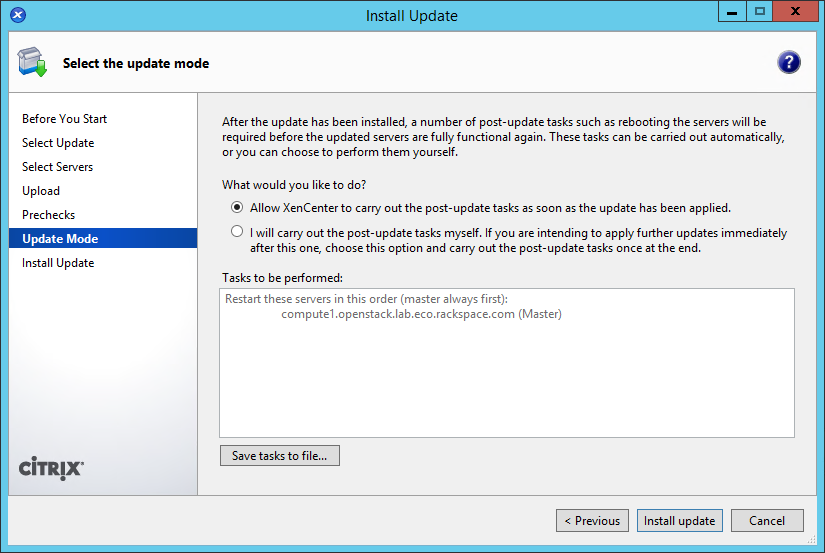
27. XenCenter will perform the installation, and reboot the server. This will take a while to complete. Click Finish when done:

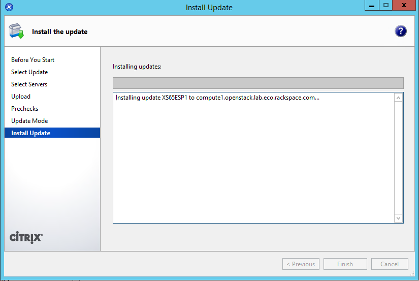
28. Repeat steps 22-27 for all of the hotfixes you downloaded. Except in step 26, select "I will carry out the post-update checks myself" for ALL of the hotfixes:

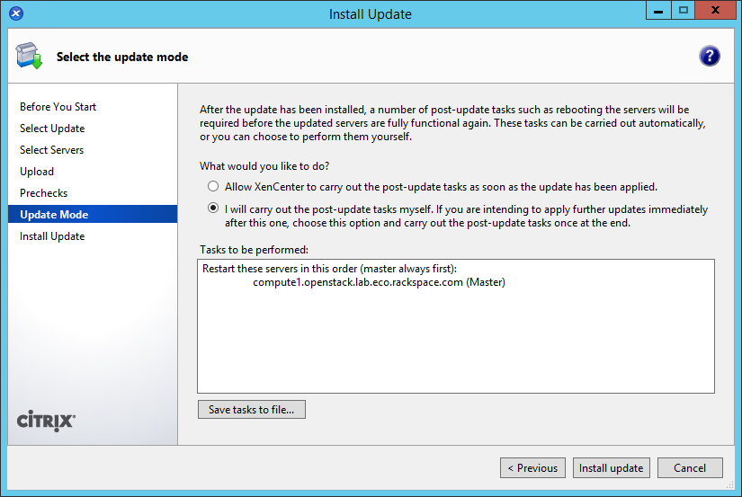
29. Reboot the XenServer by right-clicking it in XenCenter, and clicking on "Reboot":

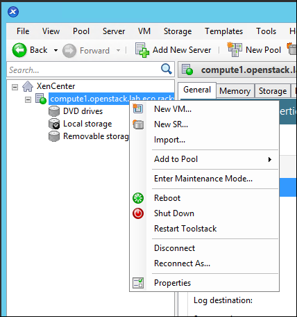

30. Once the server is back online, right-click it and select "New SR…"
31. Create an ISO library somewhere where you will have read/write access. In my case I am using a Windows share, but you can use NFS:

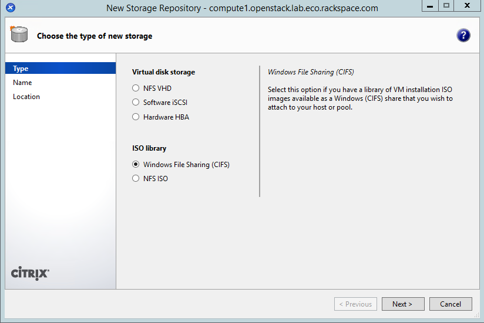

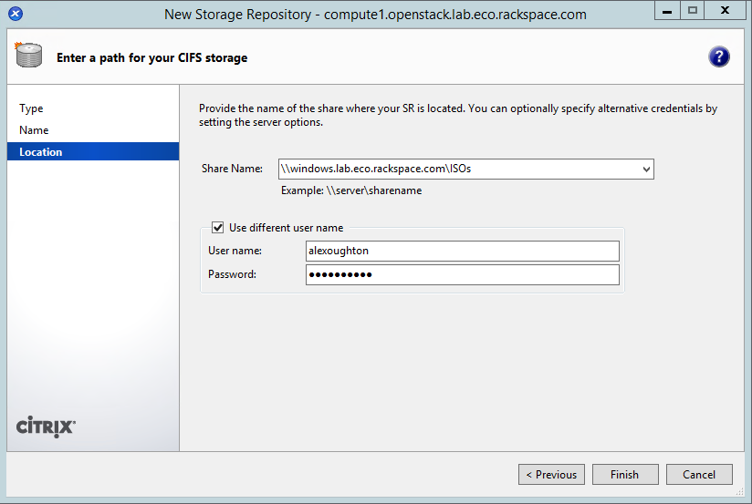

32. SSH to the XenServer as root.
33. Create the OpenStack Integration Bridge network::

     # xe network-create name-label=openstack-int-network
34. Obtain the bridge name of the new network. Write this down as ``*XAPI_BRIDGE*``, as this will be needed later::

     # xe network-list name-label=openstack-int-network params=bridge

       bridge ( RO)    : xapi0
35. Find the UUID of the ISO library created earlier::

     # xe sr-list

       uuid ( RO)                : ef0adc0a-3b56-5e9d-4824-0821f4be7ed4
                 name-label ( RW): Removable storage
           name-description ( RW):
                       host ( RO): compute1.openstack.lab.eco.rackspace.com
                       type ( RO): udev
               content-type ( RO): disk

       uuid ( RO)                : 6658e157-a534-a450-c4db-2ca6dd6296cf
                 name-label ( RW): Local storage
           name-description ( RW):
                       host ( RO): compute1.openstack.lab.eco.rackspace.com
                       type ( RO): ext
               content-type ( RO): user

       uuid ( RO)                : f04950c1-ee7b-2ccb-e3e2-127a5bffc5a6
                 name-label ( RW): CIFS ISO library
           name-description ( RW): CIFS ISO Library [\\windows.lab.eco.rackspace.com\ISOs]
                       host ( RO): compute1.openstack.lab.eco.rackspace.com
                       type ( RO): iso
               content-type ( RO): iso

       uuid ( RO)                : 7a549ca7-d1af-cf72-fd7e-2f48448354e8
                 name-label ( RW): DVD drives
           name-description ( RW): Physical DVD drives
                       host ( RO): compute1.openstack.lab.eco.rackspace.com
                       type ( RO): udev
               content-type ( RO): iso

       uuid ( RO)                : 9a4f8404-7745-b582-484f-108917bf1488
                 name-label ( RW): XenServer Tools
           name-description ( RW): XenServer Tools ISOs
                       host ( RO): compute1.openstack.lab.eco.rackspace.com
                       type ( RO): iso
               content-type ( RO): iso

* In my example, the UUID is ``f04950c1-ee7b-2ccb-e3e2-127a5bffc5a6``.

36. Set a parameter on the ISO library. Replace ``*UUID*`` with the UUID found above::

     # xe sr-param-set uuid=*UUID* other-config:i18n-key=local-storage-iso
37. Update the system hosts file with entries for all nodes::

     # vi /etc/hosts

       172.16.0.192 controller controller.openstack.lab.eco.rackspace.com
       172.16.0.203 compute1 compute1.openstack.lab.eco.rackspace.com
       172.16.0.204 compute1-vm compute1-vm.openstack.lab.eco.rackspace.com
       172.16.0.195 compute2 compute2.openstack.lab.eco.rackspace.com
       172.16.0.196 block1 block1.openstack.lab.eco.rackspace.com
       172.16.0.197 object1 object1.openstack.lab.eco.rackspace.com
       172.16.0.198 object2 object2.openstack.lab.eco.rackspace.com
