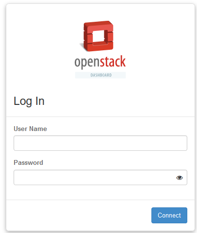
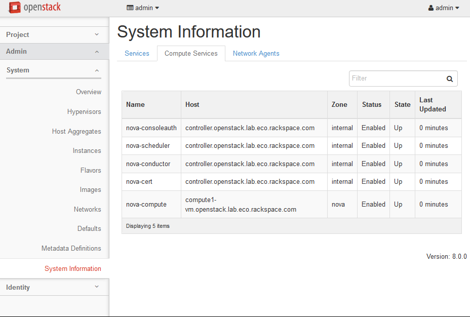
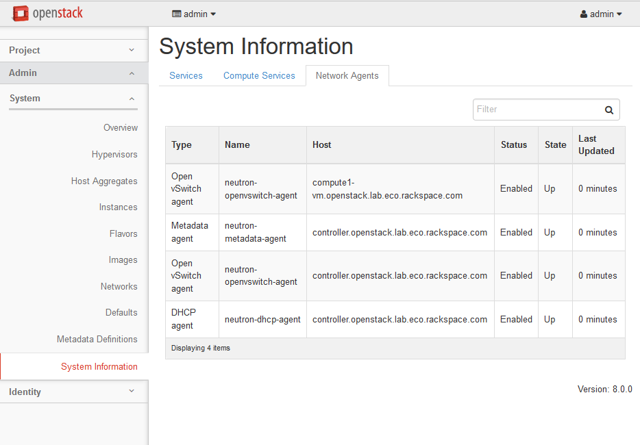

.. highlight:: none

12. Install Dashboard (horizon) on controller
=============================================

This page is based on the following OpenStack Installation Guide pages:

http://docs.openstack.org/liberty/install-guide-rdo/horizon-install.html

http://docs.openstack.org/liberty/install-guide-rdo/horizon-verify.html

**Step 3 has specific changes for the use of XenServer.**

1. Install horizon packages::

    # yum install openstack-dashboard
2. Configure horizon::

    # vim /etc/openstack-dasboard/local_settings

      OPENSTACK_CONTROLLER = "controller"
      ALLOWED_HOSTS = ['*', ]
      CACHES = {
          'default': {
               'BACKEND': 'django.core.cache.backends.memcached.MemcachedCache',
               'LOCATION': '127.0.0.1:11211',
          }
      }
      OPENSTACK_KEYSTONE_DEFAULT_ROLE = "user"
      OPENSTACK_NEUTRON_NETWORK = {
          'enable_router': False,
          'enable_quotas': False,
          'enable_distributed_router': False,
          'enable_ha_router': False,
          'enable_lb': False,
          'enable_firewall': False,
          'enable_vpn': False,
          'enable_fip_topology_check': False,
      }
      TIME_ZONE = "*TIME_ZONE*"
* Note 1: There are many options already present in the file. These should be left as-is.
* Note 2: For the ``openstack_neutron_network`` block, modify the settings listed above, rather than replacing the entire block.

3. There is a bug in Horizon which is breaking image metadata when editing XenServer images. This has been reported in https://bugs.launchpad.net/horizon/+bug/1539722. Until the bug is fixed, here is a quick and dirty patch to avoid the problem:

    a. Open the forms.py file::

        # vim /usr/share/openstack-dashboard/openstack_dashboard/dashboards/project/images/images/forms.py
    b. Locate the following lines (should be lines 60 and 61)::

        else:
              container_format = 'bare'
    c. Add the following two lines above those lines::

        elif disk_format == 'vhd':
              container_format = 'ovf'
    d. The whole section should now read::

        elif disk_format == 'vhd':
              container_format = 'ovf'
        else:
              container_format = 'bare'

4. Enable and restart the Apahce and memcached services::

    # systemctl enable httpd.service memcached.service
    # systemctl restart httpd.service memcached.service

5. From a web browser, access http://``*CONTROLLER_ADDRESS*``/dashboard:

6. Log in using the admin credentials.
7. In the left-hand menu, under "Admin" and then "System", click on "System Information". This will display a list of compute services and network agents:

