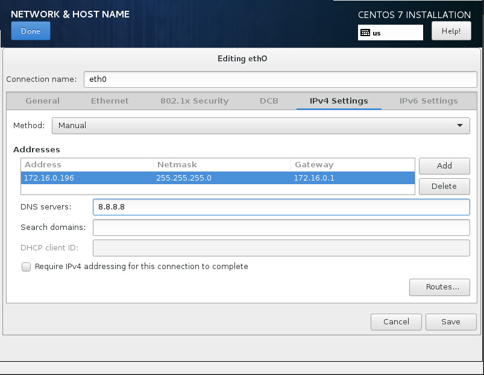
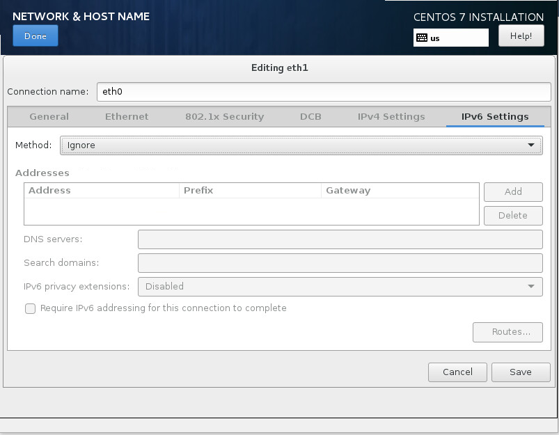
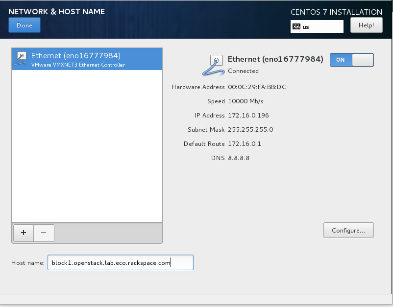

.. highlight:: none

13. Build block1 storage node OS
================================

This page is based on the following OpenStack Installation Guide pages:

http://docs.openstack.org/liberty/install-guide-rdo/environment-networking-storage-cinder.html

http://docs.openstack.org/liberty/install-guide-rdo/environment-ntp-other.html

http://docs.openstack.org/liberty/install-guide-rdo/environment-packages.html

1. The block1 node will need to have a large second disk on which to store the cinder volumes. You may also wish to give it a large amount of storage at /var/lib/cinder/conversion (or /) if you will be writing large images to cinder volumes. It will only need a connection to the Management Network.
2. Boot the control node with the CentOS 7.2.1511 DVD.
3. Set your time zone and language.
4. For "Software Selection", set this to "Infrastructure Server".
5. Keep automatic partitioning. Allow to install only on first disk.
6. Set the controller's IPv4 address and hostname. Disable IPv6. Give the connection the name "eth0".

7. Click on "Begin Installation".
8. Set a good root password.
9. Once installation is complete, reboot the server, and remove the DVD/ISO from the server.

10. SSH in to server as root.
11. Stop and disable the firewalld service::

     # systemctl disable firewalld.service
     # systemctl stop firewalld.service
12. Disable SELINUX::

     # setenforce 0
     # vim /etc/sysconfig/selinux

       SELINUX=permissive
13. Update all packages on the server::

     # yum update
14. If running the control node on VMWare, install the VM tools::

     # yum install open-vm-tools
15. We need persistent network interface names, so we'll configure udev to give us these. Replace ``00:00:00:00:00:00`` with the MAC address of your block1 node::

     # vim /etc/udev/rules.d/90-persistent-net.rules

       SUBSYSTEM=="net", ACTION=="add", DRIVERS=="?*",ATTR{address}=="00:00:00:00:00:00",ATTR{dev_id}=="0x0", ATTR{type}=="1",KERNEL=="eno*", NAME="eth0"

* Note: This file is case-sensitive, and the MAC addresses should be lower-case.

16. Rename the network interface configuration file to ``eth0``. Replace ``eno00000001`` with the name of your control node's interfaces::

     # cd /etc/sysconfig/network-scripts
     # mv ifcfg-eno00000001 ifcfg-eth0
17. Modify the interface configuration files, replacing any instances of ``eno00000001`` (or whatever your interface name is) with ``eth0``::

     # vim ifcfg-eth0

       NAME=eth0
       DEVICE=eth0
18. Reboot the control node::

     # systemctl reboot

19. SSH back in as root after the reboot.
20. Check that ifconfig now shows ``eth0``::

     # ifconfig
       eth0: flags=4163<UP,BROADCAST,RUNNING,MULTICAST>  mtu 1500
              inet 172.16.0.196  netmask 255.255.255.0  broadcast 172.16.0.255
              inet6 fe80::20c:29ff:fefa:bbdc  prefixlen 64  scopeid 0x20<link>
              ether 00:0c:29:fa:bb:dc  txqueuelen 1000  (Ethernet)
              RX packets 322224  bytes 137862468 (131.4 MiB)
              RX errors 0  dropped 35  overruns 0  frame 0
              TX packets 408936  bytes 108141349 (103.1 MiB)
              TX errors 0  dropped 0 overruns 0  carrier 0  collisions 0

       lo: flags=73<UP,LOOPBACK,RUNNING>  mtu 65536
              inet 127.0.0.1  netmask 255.0.0.0
              inet6 ::1  prefixlen 128  scopeid 0x10<host>
              loop  txqueuelen 0  (Local Loopback)
              RX packets 6  bytes 564 (564.0 B)
              RX errors 0  dropped 0  overruns 0  frame 0
              TX packets 6  bytes 564 (564.0 B)
              TX errors 0  dropped 0 overruns 0  carrier 0  collisions 0
21. Update the system hosts file with entries for all nodes::

     # vim /etc/hosts

       172.16.0.192 controller controller.openstack.lab.eco.rackspace.com
       172.16.0.203 compute1 compute1.openstack.lab.eco.rackspace.com
       172.16.0.204 compute1-vm compute1-vm.openstack.lab.eco.rackspace.com
       172.16.0.195 compute2 compute2.openstack.lab.eco.rackspace.com
       172.16.0.196 block1 block1.openstack.lab.eco.rackspace.com
       172.16.0.197 object1 object1.openstack.lab.eco.rackspace.com
       172.16.0.198 object2 object2.openstack.lab.eco.rackspace.com
22. Update the chrony configuration to use the controller as a time source::

     # vim /etc/chrony.conf

       server controller iburst
* Remove any other servers listed, leaving only "``controller``".

23. Restart the chrony service, and confirm that "``controller``" is listed as a source::

     # systemctl restart chronyd.service
     # chronyc sources
       210 Number of sources = 1
       MS Name/IP address         Stratum Poll Reach LastRx Last sample
       ===============================================================================
       ^* controller                    3   6    17     6  -3374ns[+2000ns] +/- 6895us
24. Enable the OpenStack-Liberty yum repository::

     # yum install centos-release-openstack-liberty
25. Install the OpenStack client and SELINUX support::

     # yum install python-openstackclient openstack-selinux
