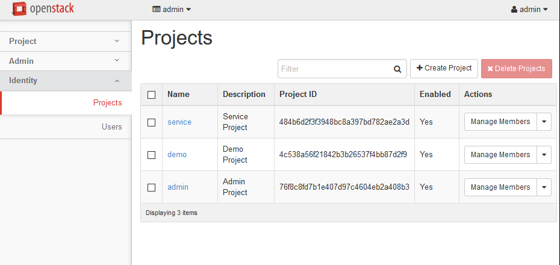
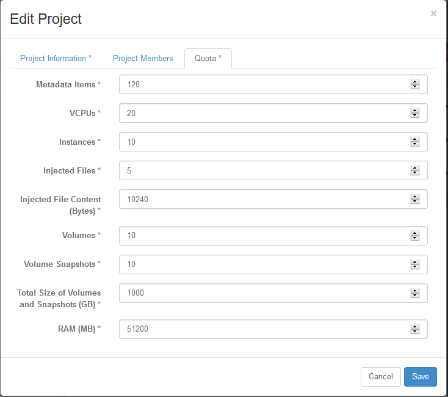

.. highlight:: none

16. Fix cinder quotas for the demo project
==========================================

This page is not based on the OpenStack Installation Guide. I found that a bug causes nova to believe that the demo project has a 0 quota for cinder volumes, even though neutron states that the quota is 10. Re-saving the value populates the value properly in nova.

1. From a web browser, access http://``*CONTROLLER_ADDRESS*``/dashboard
2. Log in using the admin credentials.
3. In the left-hand menu, under "Identity", click on "Projects":

4. In the "Actions" drop-down for the "demo" project, select modify quotas:

5. Don't make any changes. Just click "Save".
