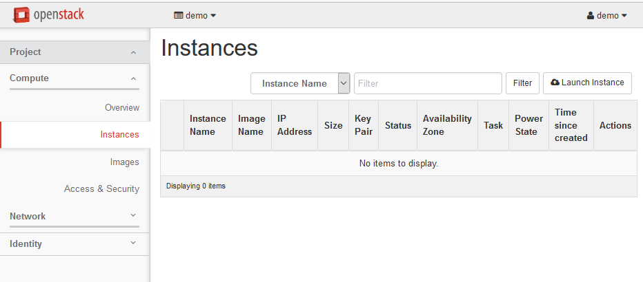
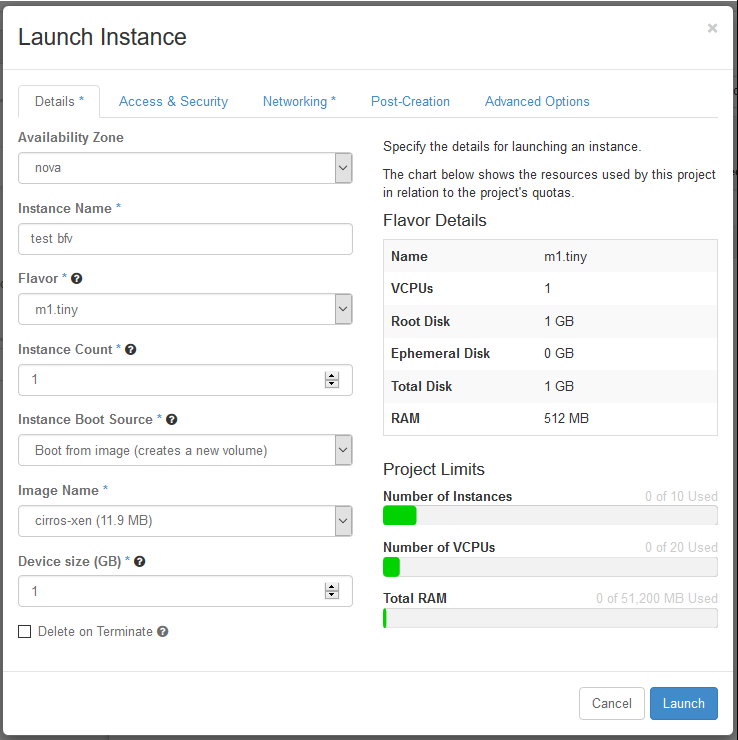
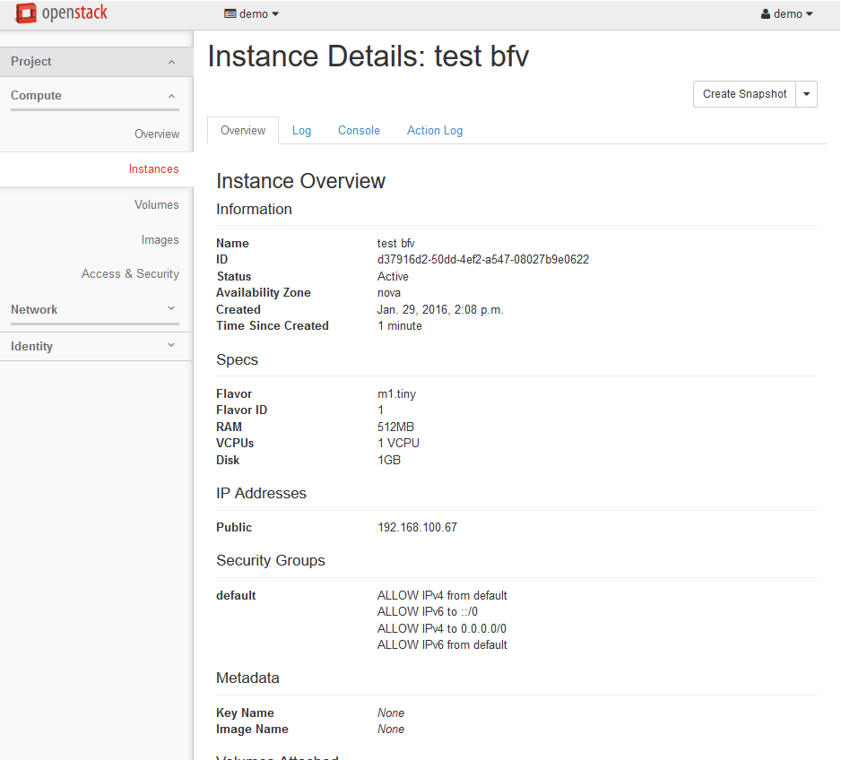
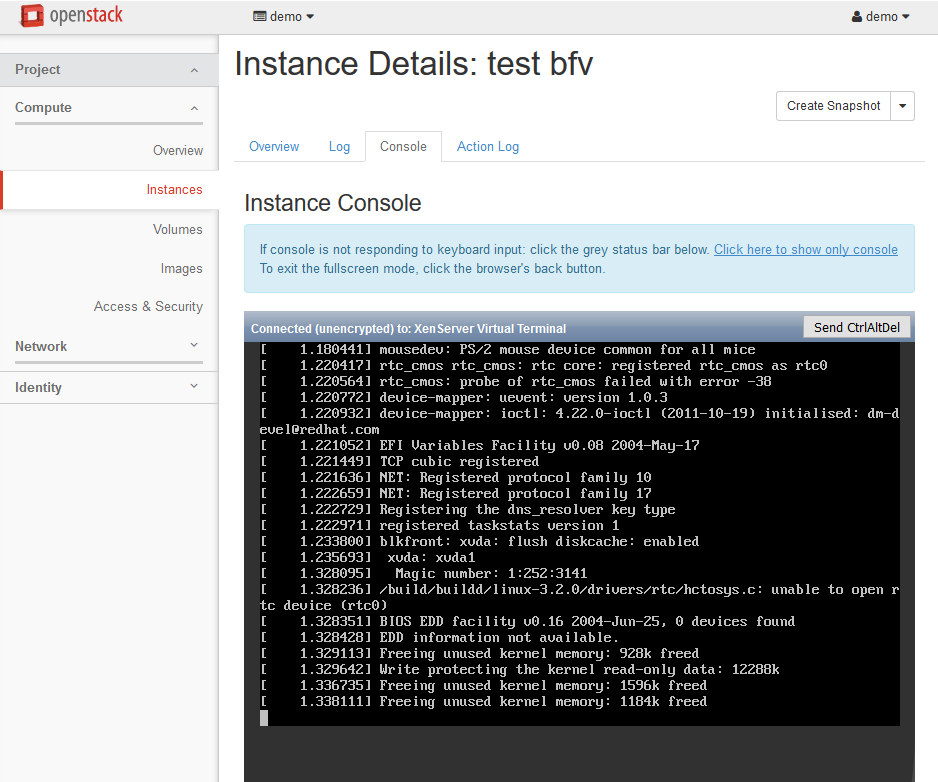
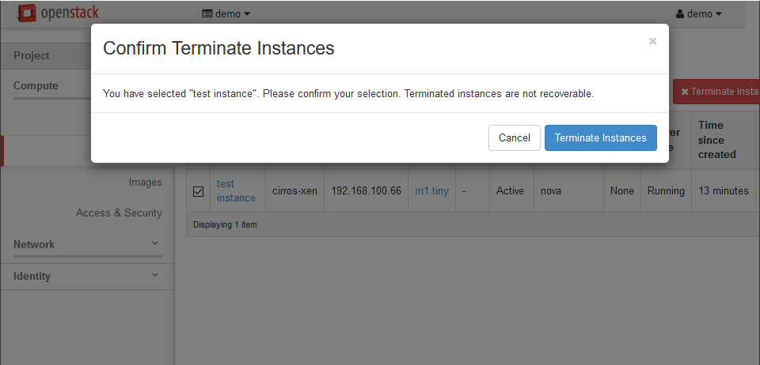

.. highlight:: none

17. Launch a test Boot-From-Volume instance from Horizon
========================================================

This page is not based on the OpenStack Installation Guide.

1. From a web browser, access http://``*CONTROLLER_ADDRESS*``/dashboard.
2. Log in using the demo credentials.
3. In the left-hand menu, under "Project", and then "Compute", click on "Instances". Click on Launch instance:

4. Give the instance the name "test bfv", and select "Boot from image (creates a new volume)" and the "cirros-xen" image. Launch the instance:

5. Once the instance enters "Active" status, click on its name:

6. Click on the "Console" tab, and you should see the instance booting. Wait for the login prompt:

7. Once the login prompt has appeared, check that you can ping and SSH to the instance. The credentials are:

    * Username: ``cirros``
    * Password: ``cubswin:)``

8. In the left-hand menu, click on "Instances" again, select the "test instance" in the list and click on "Terminate Instances":

