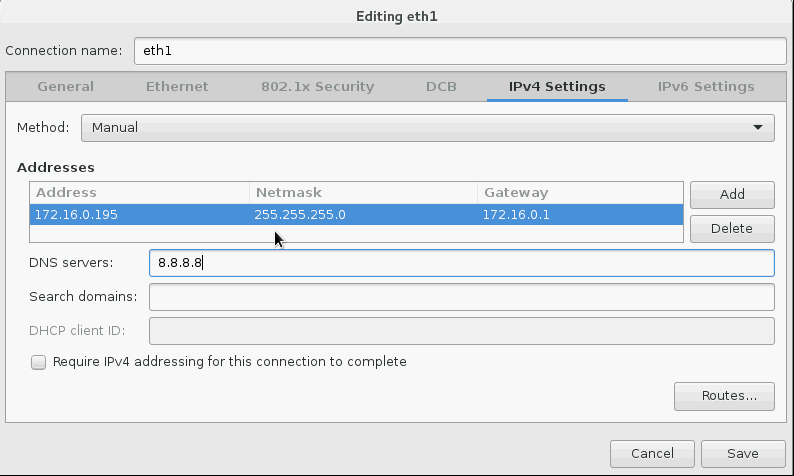
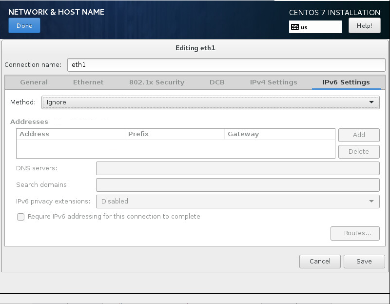
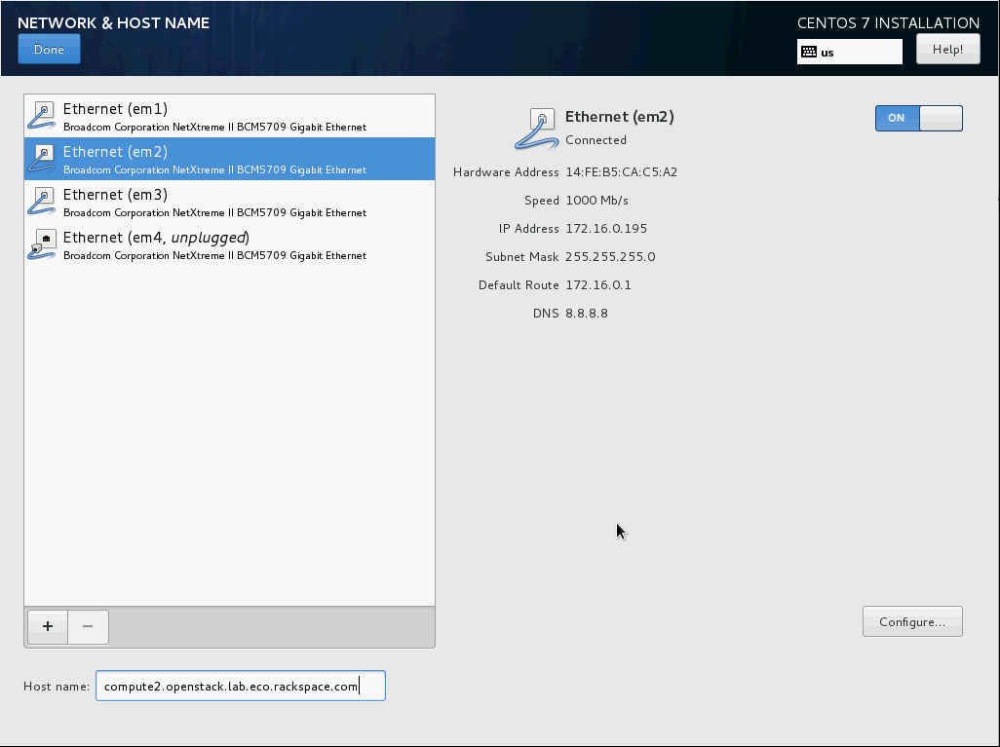

.. highlight:: none

18. Build KVM Host
==================

This page is based on the following OpenStack Installation Guide pages:

http://docs.openstack.org/liberty/install-guide-rdo/environment-networking-compute.html

http://docs.openstack.org/liberty/install-guide-rdo/environment-ntp-other.html

http://docs.openstack.org/liberty/install-guide-rdo/environment-packages.html

1. In this guide I am using a server with a small RAID-1 for the OS, and a large RAID-10 for the VMs. There are four network interfaces, although only the first two are in use.
2. Boot the KVM host with the CentOS 7.2.1511 DVD.
3. Set your time zone and language.
4. For "Software Selection", set this to "Infrastructure Server".
5. Keep automatic partitioning. Allow to install only on first disk.
6. Set the node's IPv4 address on the management network interface and disable IPv6. Give the connection the name "eth1". Set the node's hostname:

7. Click on "Begin Installation".
8. Set a good root password.
9. Once installation is complete, reboot the server, and remove the DVD/ISO from the server.
10. SSH in to server as root.
11. Stop and disable the firewalld service::

     # systemctl disable firewalld.service
     # systemctl stop firewalld.service
12. Disable SELINUX::

     # setenforce 0
     # vim /etc/sysconfig/selinux

       SELINUX=permissive
13. Update all packages on the server::

     # yum update
14. We need persistent network interface names, so we'll configure udev to give us these. Replace ``00:00:00:00:00:00`` with the MAC addresses of your KVM node::

     # vim /etc/udev/rules.d/90-persistent-net.rules

       SUBSYSTEM=="net", ACTION=="add", DRIVERS=="?*",ATTR{address}=="00:00:00:00:00:00",ATTR{dev_id}=="0x0", ATTR{type}=="1",KERNEL=="em*", NAME="eth0"
       SUBSYSTEM=="net", ACTION=="add", DRIVERS=="?*",ATTR{address}=="00:00:00:00:00:00",ATTR{dev_id}=="0x0", ATTR{type}=="1",KERNEL=="em*", NAME="eth1"
       SUBSYSTEM=="net", ACTION=="add", DRIVERS=="?*",ATTR{address}=="00:00:00:00:00:00",ATTR{dev_id}=="0x0", ATTR{type}=="1",KERNEL=="em*", NAME="eth2"
       SUBSYSTEM=="net", ACTION=="add", DRIVERS=="?*",ATTR{address}=="00:00:00:00:00:00",ATTR{dev_id}=="0x0", ATTR{type}=="1",KERNEL=="em*", NAME="eth3"

* Note: This file is case-sensitive, and the MAC addresses should be lower-case.

15. Rename the network interface configuration files to eth0 and eth1. Replace ``em1`` , ``em2`` , ``em3`` and ``em4`` with the names of your KVM node's interfaces::

     # cd /etc/sysconfig/network-scripts
     # mv ifcfg-em1 ifcfg-eth0
     # mv ifcfg-em2 ifcfg-eth1
     # mv ifcfg-em3 ifcfg-eth2
     # mv ifcfg-em4 ifcfg-eth3
16. Modify the interface configuration files, replacing any instances of ``em1`` , ``em2`` , ``em3`` , ``em4`` (or whatever your interface names are) with ``eth0`` , ``eth1`` , ``eth2`` and ``eth3`` respectively::

     # vim ifcfg-eth0

       NAME=eth0
       DEVICE=eth0

     # vim ifcfg-eth1

       NAME=eth1
       DEVICE=eth1

     # vim ifcfg-eth2

       NAME=eth2
       DEVICE=eth2

     # vim ifcfg-eth3

       NAME=eth3
       DEVICE=eth3
17. Reboot the KVM node::

     # systemctl reboot
18. SSH back in as root after the reboot.
19. Check that ifconfig now shows ``eth0`` , ``eth1`` , ``eth2`` and ``eth3``::

     # ifconfig
       eth0: flags=4163<UP,BROADCAST,RUNNING,MULTICAST>  mtu 1500
               ether 14:fe:b5:ca:c5:a0  txqueuelen 1000  (Ethernet)
               RX packets 1195904  bytes 1012346616 (965.4 MiB)
               RX errors 0  dropped 0  overruns 0  frame 0
               TX packets 366843  bytes 28571196 (27.2 MiB)
               TX errors 0  dropped 0 overruns 0  carrier 0  collisions 0

       eth1: flags=4163<UP,BROADCAST,RUNNING,MULTICAST>  mtu 1500
               inet 172.16.0.195  netmask 255.255.255.0  broadcast 172.16.0.255
               inet6 fe80::16fe:b5ff:feca:c5a2  prefixlen 64  scopeid 0x20<link>
               ether 14:fe:b5:ca:c5:a2  txqueuelen 1000  (Ethernet)
               RX packets 12004890  bytes 15236092868 (14.1 GiB)
               RX errors 0  dropped 156  overruns 0  frame 0
               TX packets 12647929  bytes 15934829339 (14.8 GiB)
               TX errors 0  dropped 0 overruns 0  carrier 0  collisions 0

       eth2: flags=4163<UP,BROADCAST,RUNNING,MULTICAST>  mtu 1500
               ether 14:fe:b5:ca:c5:a4  txqueuelen 1000  (Ethernet)
               RX packets 1985034  bytes 180158767 (171.8 MiB)
               RX errors 0  dropped 252  overruns 0  frame 0
               TX packets 0  bytes 0 (0.0 B)
               TX errors 0  dropped 0 overruns 0  carrier 0  collisions 0

       eth3: flags=4099<UP,BROADCAST,MULTICAST>  mtu 1500
               ether 14:fe:b5:ca:c5:a6  txqueuelen 1000  (Ethernet)
               RX packets 0  bytes 0 (0.0 B)
               RX errors 0  dropped 0  overruns 0  frame 0
               TX packets 0  bytes 0 (0.0 B)
               TX errors 0  dropped 0 overruns 0  carrier 0  collisions 0

       lo: flags=73<UP,LOOPBACK,RUNNING>  mtu 65536
               inet 127.0.0.1  netmask 255.0.0.0
               inet6 ::1  prefixlen 128  scopeid 0x10<host>
               loop  txqueuelen 0  (Local Loopback)
               RX packets 9855259  bytes 517557258 (493.5 MiB)
               RX errors 0  dropped 0  overruns 0  frame 0
               TX packets 9855259  bytes 517557258 (493.5 MiB)
               TX errors 0  dropped 0 overruns 0  carrier 0  collisions 0

20. Update the system hosts file with entries for all nodes::

     # vim /etc/hosts

     172.16.0.192 controller controller.openstack.lab.eco.rackspace.com
     172.16.0.203 compute1 compute1.openstack.lab.eco.rackspace.com
     172.16.0.204 compute1-vm compute1-vm.openstack.lab.eco.rackspace.com
     172.16.0.195 compute2 compute2.openstack.lab.eco.rackspace.com
     172.16.0.196 block1 block1.openstack.lab.eco.rackspace.com
     172.16.0.197 object1 object1.openstack.lab.eco.rackspace.com
     172.16.0.198 object2 object2.openstack.lab.eco.rackspace.com
21. Update the chrony configuration to use the controller as a time source::

     # vim /etc/chrony.conf

       server controller iburst
* Remove any other servers listed, leaving only "``controller``".

22. Restart the chrony service, and confirm that "``controller``" is listed as a source::

     # systemctl restart chronyd.service
     # chronyc sources
       210 Number of sources = 1
       MS Name/IP address         Stratum Poll Reach LastRx Last sample
       ===============================================================================
       ^* controller                    3   6    17     6  -3374ns[+2000ns] +/- 6895us
23. Enable the OpenStack-Liberty yum repository::

     # yum install centos-release-openstack-liberty
24. Install the OpenStack client and SELINUX support::

     # yum install python-openstackclient openstack-selinux
