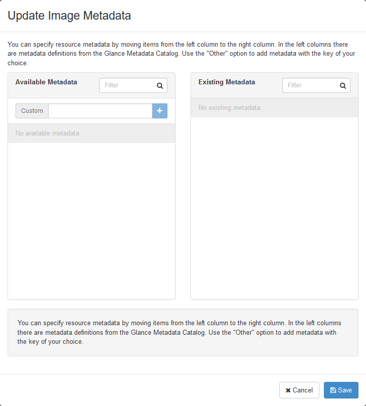

.. highlight:: none

21. Update images for dual-hypervisor environment
=================================================

This page is not based on the OpenStack Installation Guide.

1. Log on to the controller node as root.
2. Download the cirros image for KVM hypervisors::

    # wget http://download.cirros-cloud.net/0.3.4/cirros-0.3.4-x86_64-disk.img
3. Upload the image to glance::

    # source admin-openrc.sh
    # glance image-create --name "cirros-kvm" --file cirros-0.3.4-x86_64-disk.img --disk-format qcow2 --container-format bare --visibility public --progress
4. From a web browser, access http://*CONTROLLER_ADDRESS*/dashboard
5. Log in using the admin credentials.
6. In the left-hand menu, under "Admin", and then "System", click on "Images". Click on the "cirros-kvm" image:

7. In the top-right drop-down, click on "Update Metadata":

8. On the left-hand side, in the "custom" box, enter "hypervisor_type", and then click on the + button:

10. Now, on the right-hand side, in the "hypervisor_type" box, enter "kvm" and click "Save":

11. In the left-hand menu, under "Admin", and then "System", again click on "Images". This time click on the "cirros-xen" image.
12. Again click on "Update Metadata" in the drop-down. Follow the same steps, but set "hypervisor_type" to "xen":

