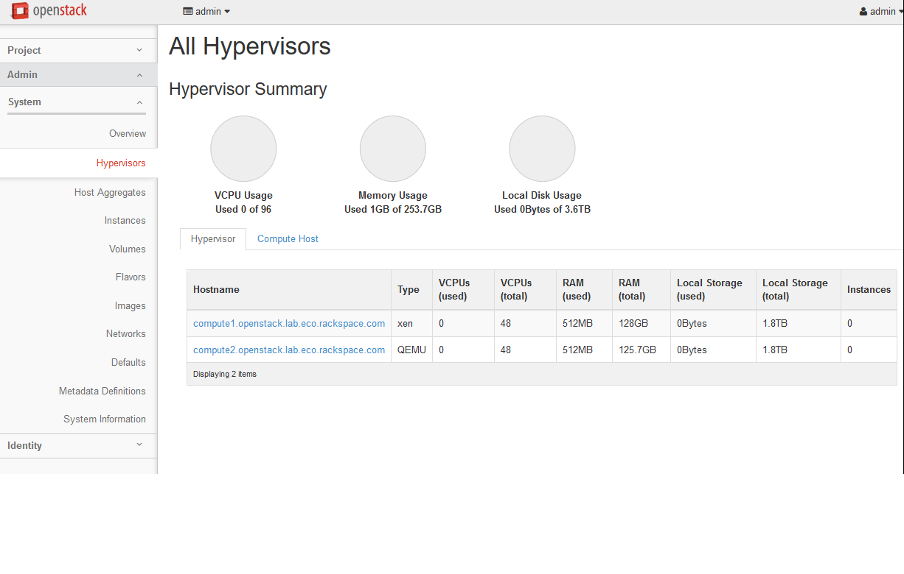
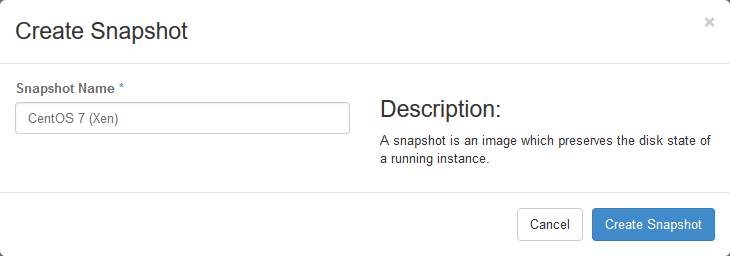
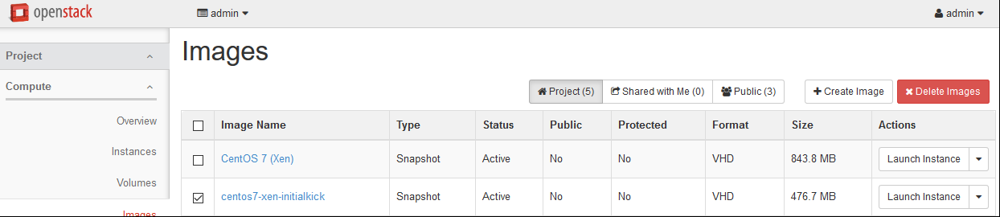

.. highlight:: none

22. Create Xen CentOS 7 Image
=============================

This page is not based on the OpenStack Installation Guide.

1. Log on to the control node as root.
2. Download the CentOS 7 ISO, and upload it to glance::

    # wget http://mirror.rackspace.com/CentOS/7.2.1511/isos/x86_64/CentOS-7-x86_64-NetInstall-1511.iso
    # source admin-openrc.sh
    # glance image-create --name "CentOS 7 ISO" --file CentOS-7-x86_64-NetInstall-1511.iso --disk-format iso --container-format bare --visibility public --progress
3. From a web browser, access http://``*CONTROLLER_ADDRESS*``/dashboard
4. Log in using the admin credentials.
5. In the left-hand menu, under "Admin", and then "System", click on "Hypervisors":

6. Click on the "Compute Host" tab:

.. image:: assets/page22-compute-host.png
7. Next to "compute2", click on "Disable Service".
8. Enter a reason of "Building Xen image", and click "Disable Service":

9. In the left-hand menu, under "Project", and then "Compute", click on "Instances". Click on "Launch Instance".
10. Give the instance the name "centos7-xen-build", use the flavor m1.small (for a 20GB disk), and select "Boot from image" and the "CentOS 7 ISO" image. Launch the instance:

.. image:: assets/page22-launch-instance1.png
11. Wait for the instance to enter "Active" state. Then click on the instance. Click on the "Console" tab, and then click on the grey "Connected (unencrypted) to: QEMU" bar so that keyboard input will be directed to the console:

12. Highlight "Install CentOS 7", and press Enter. Wait for the installer to start:

13. Set language and timezone.
14. Click on "Network & Hostname". Enable the network interface by setting the switch to "On":

15. Click on "Installation Source". Set the source to network, and then define a known-good mirror. You can use ``http://mirror.rackspace.com/CentOS/7.2.1511/os/x86_64/``.
16. Click on "Installation Destination". Select "I will configure partitioning" and click on "Done":

17. Click the arrow next to the word "Unknown" to expand that section and display the partition.  Select "Reformat", set the file system to "ext4", and set the mount point to "/". Click Done:

18. A yellow warning bar will appear. Click "Done" again, and then click on "Accept Changes".

19. Click on "Software Selection". Select "Infrastructure Server", and click "Done".

20. Click "Begin Installation". Click on "Root Password" and set a good password.
21. Once installation is complete, click "Reboot".
22. When reboot completes, your connection to the console will likely die. Refresh the page, click on the "Console" tab again, and then click on the grey banner again.
23. The server will be attempting to boot from the ISO once more. Press any key to stop the countdown.
24. In the top-right of the page, click the "Create Snapshot" button:

25. Call the image "centos7-xen-initialkick" and click on "Create Snapshot":

26. Horizon will show the "Images" page. Wait until "centos7-xen-initialkick" reaches "Active" status, and then click on the image.
27. In the top-right drop-down, click on "Update Metadata".
28. On the left-hand side, in the "custom" box, enter "vm_mode" and click on the + button.
29. On the right-hand side, in the "vm_mode" box, enter "hvm".
30. On the left-hand side, in the "custom" box, enter "hypervisor_type" and click on the + button.
31. On the right-hand side, in the "hypervisor_type" box, enter "xen", and click on the "Save" button:

32. In the left-hand menu, under "Project", and then "Compute", click on "Instances".
33. Highlight the "centos7-xen-build" instance, and click on "Terminate Instances".

34. Click "Terminate Instance" again to confirm:

35. Click on "Launch Instance". Give the instance the name "centos7-xen-build", use the flavor m1.small (for a 20GB disk), and select "Boot from image" and the "centos7-xen-initialkick" image. Launch the instance:

36. Wait for the instance to enter "Active" state. SSH to the new instance as "root", using the root password used during setup.
37. Delete the static hostname file::

     # rm /etc/hostname
38. Stop and disable the firewalld service::

     # systemctl disable firewalld.service
     # systemctl stop firewalld.service
39. Disable SELINUX::

     # setenforce 0
     # vim /etc/sysconfig/selinux

       SELINUX=permissive
40. Update all packages on the server::

     # yum update
41. Download and install the XenServer tools::

     # wget http://boot.rackspace.com/files/xentools/xs-tools-6.5.0-20200.iso
     # mkdir /mnt/cdrom
     # mount -o loop xs-tools-6.5.0-20200.iso /mnt/cdrom
     # cd /mnt/cdrom/Linux
     # rpm -Uvh xe-guest-utilities-xenstore-6.5.0-1427.x86_64.rpm xe-guest-utilities-6.5.0-1427.x86_64.rpm
     # cd ~
     # umount /mnt/cdrom
     # rm xs-tools-6.5.0-20200.iso
42. Reboot the instance::

     # systemctl reboot
43. Wait for the server to reboot, and then log back in as root.
44. Install the nova-agent::

     # rpm -Uvh https://github.com/rackerlabs/openstack-guest-agents-unix/releases/download/1.39.1/nova-agent-1.39-1.x86_64.rpm
45. Create a CentOS 7.2-compatible systemd unit file for the nova-agent service::

     # vim /usr/lib/systemd/system/nova-agent.service

       [Unit]
       Description=nova-agent service
       After=xe-linux-distribution.service

       [Service]
       EnvironmentFile=/etc/nova-agent.env
       ExecStart=/usr/sbin/nova-agent -n -l info /usr/share/nova-agent/nova-agent.py

       [Install]
       WantedBy=multi-user.target

46. Create a python environment file for the nova-agent service::

     # vim /etc/nova-agent.env

       LD_LIBRARY_PATH="${LD_LIBRARY_PATH}:/usr/share/nova-agent/1.39.1/lib"
       PYTHONPATH="${PYTHONPATH}:/usr/share/nova-agent/1.39.1/lib/python2.6/site-packages:/usr/share/nova-agent/1.39.1/lib/python2.6/"
47. Reload systemd to import the new unit file::

     # systemctl daemon-reload
48. Enable and start the nova-agent service::

     # systemctl enable nova-agent.service
     # systemctl start nova-agent.service
49. Remove the static network configuration file::

     # rm /etc/sysconfig/network-scripts/ifcfg-eth0
50. Clear the root bash history::

     # rm /root/.bash_history; history -c
51. In horizon, click the "Create Snapshot" button next to the Instance. Name the image "CentOS 7 (Xen)":

52. Wait for the image to go to "Active" state and then, from the drop-down box next to the image, click on "Update Metadata".
53. On the left-hand side, in the "Custom" box, enter "xenapi_use_agent", and then click the + button.
54. On the right-hand side, in the "xenapi_use_agent", enter "true" and then click the Save button:

55. In the drop-down box next to the image, click on "Edit Image".
56. Check the "public" and "protected" boxes, and click on "Update Image":

57. Select the "centos7-xen-initialkick" image, and click on "Delete Images". Click "Delete Images" to confirm:

58. In the left-hand menu, under "Project" and then "Compute", click on "Instances".
59. Highlight the "centos7-xen-build" instance, and click on "Terminate Instances".  Click "Terminate Instances" to confirm:

60. In the left-hand menu, under "Admin" and then "System" click on "Hypervisors". Next to "compute2", click on "Enable Service".
