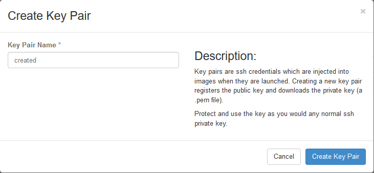

.. highlight:: none

23. Launch test Xen CentOS 7 Instance
=====================================

This page is not based on the OpenStack Installation Guide.

1. From a web browser, access http://``*CONTROLLER ADDRESS*``/dashboard.
2. Log in using the demo credentials.
3. In the left-hand menu, under "Project", and then "Compute", click on "Access & Security". Click on the "Key Pairs" tab:

4. If you have an SSH keypair already available which you would like to use, click on "Import Key Pair". Give the key a name and then paste in your public key:

5. Alternatively, if you would like to create a new pair, click on "Create Key Pair. Give the key a name and click on "Create Key Pair. Download the key for use in your SSH client:

6. In the left-hand menu, under "Project", and then "Compute", click on "Instances".
7. Click on "Launch Instance". Name the instance "``centos7-test``", select the "m1.small" flavor, and "boot from image". Choose the "CentOS 7 (Xen)" image. Before clicking on "Launch", click on the "Access & Security" tab:

8. Ensure that the key pair you just created or imported is selected, and then click on Launch:

9. Wait for the instance to go to "Active" state, and then SSH to the server as "root", using the key pair you just created or imported.
10. When you are satisfied that the test instance is working, select it and then click on "Terminate Instances". Click on "Terminate Instances" to confirm.

