.. highlight:: none

24. Create KVM CentOS 7 Image
=============================

This page is not based on the OpenStack Installation Guide.

1. From a web browser, access http://``*CONTROLLER_ADDRESS*``/dashboard.
2. Log in using the admin credentials.
3. In the left-hand menu, under "Admin", and then "System", click on "Hypervisors":

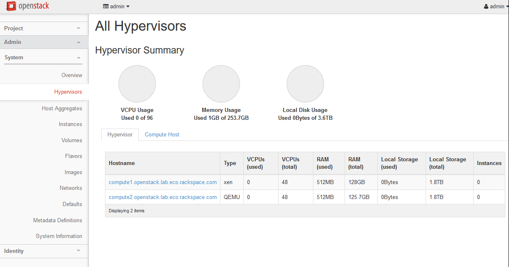
4. Click on the "Compute Host" tab:

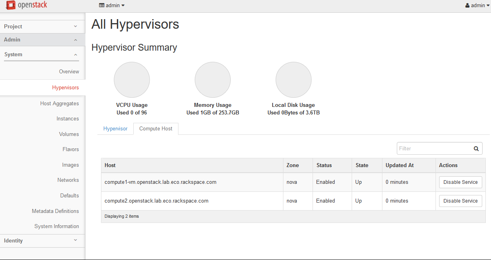
5. Next to "compute1-vm", click on "Disable Service".
6. Enter a reason of "Building KVM image", and click "Disable Service":

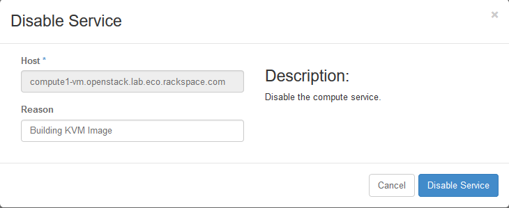
7. In the left-hand menu, under "Project", and then "Compute", click on "Instances". Click on "Launch Instance".
8. Give the instance the name "``centos7-kvm-build``", use the flavor m1.small (for a 20GB disk), and select "Boot from image" and the "CentOS 7 ISO" image. Launch the instance:

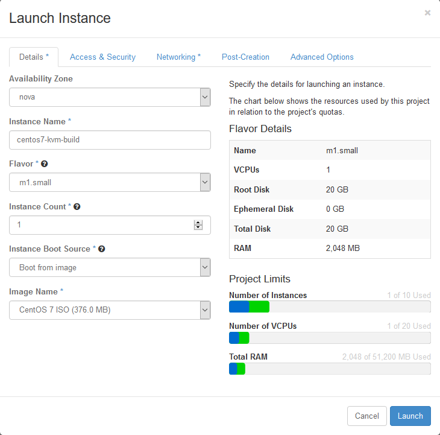
9. Wait for the instance to enter "Active" state. Then, in the left-hand menu, under "Project", and then "Compute", click on "Volumes". Click on "Create Volume".
10. Name the image "``centos7-kvm-build``", and set the size to 20 GB. Click "Create Volume":

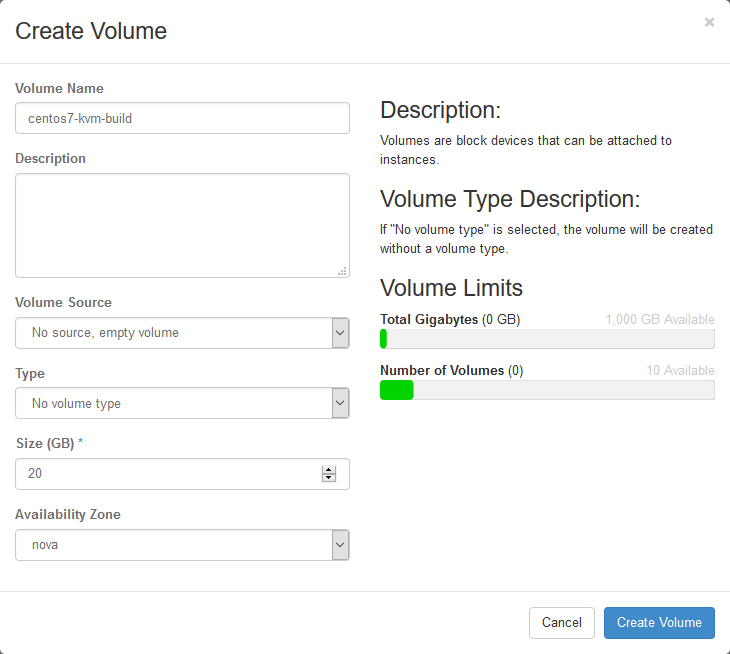
11. Once the volume enters "Available" status, click the "Actions" drop-down next to the volume, and select "Manage Attachments".
12. Under "Attach to instance", select "centos7-kvm-build", and click "Attach Volume":

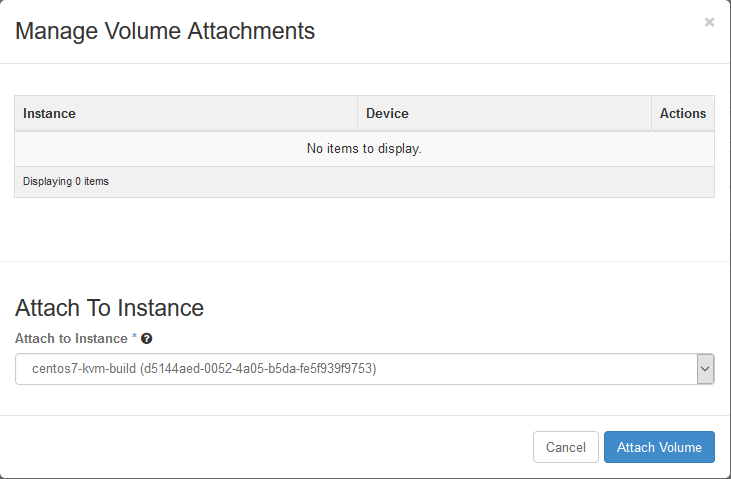
13. In the left-hand menu, under "Project", and then "Compute", click on "Instances". Under the "Actions" drop-down for the "centos7-kvm-build" instance, click on "Hard Reboot Instance". Click on "Hard Reboot Instance" to confirm:

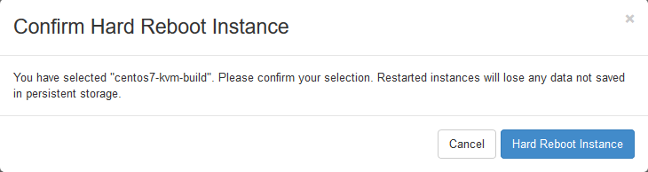
14. Wait for the instance to go back to "Active" state, and then click on the instance. Click on the "Console" tab, and then click on the grey "Connected (unencrypted) to: QEMU" bar so that keyboard input will be directed to the console:

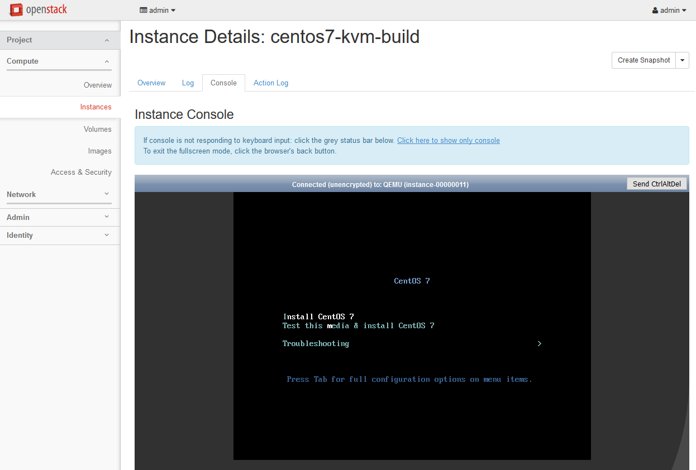
15. Highlight "Install CentOS 7", and Enter.
16. Wait for the installer to boot:

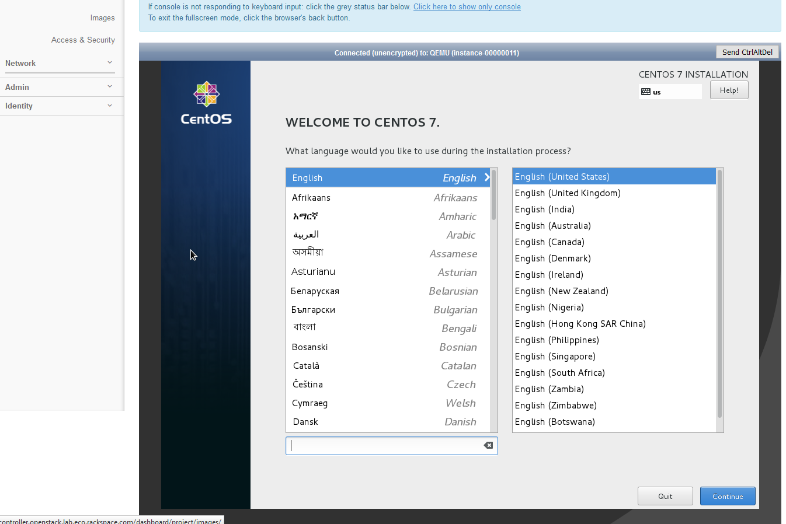
17. Select language and set the timezone.
18. Click on "network & hostname" and activate the network interface by setting the switch to "On":

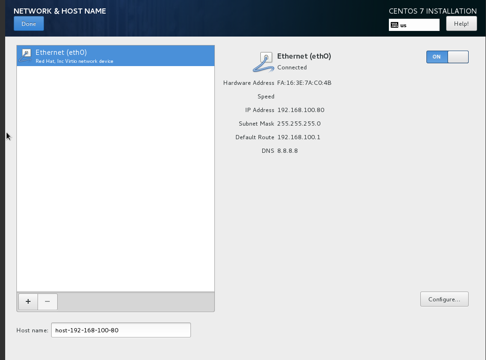
19. Click on "Installation Source". Set the source to network, and then define a known-good mirror. You can use ``http://mirror.rackspace.com/CentOS/7.2.1511/os/x86_64/``.
20. Click on "Installation Destination". Select "I will configure partitioning" and click on "Done":

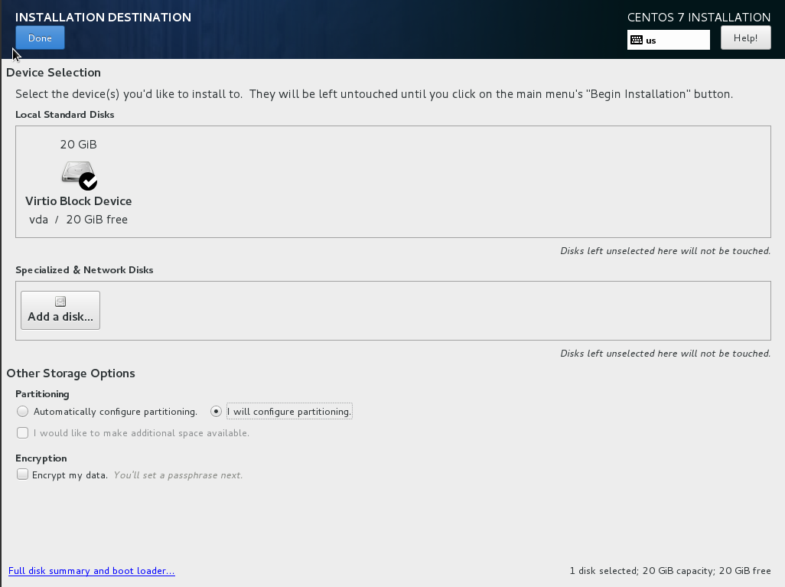
21. Under "New mount points will use the following partition scheme", select "Standard Partition".
22. Click on the + button. Set the mount point to / and click "Add mount point":

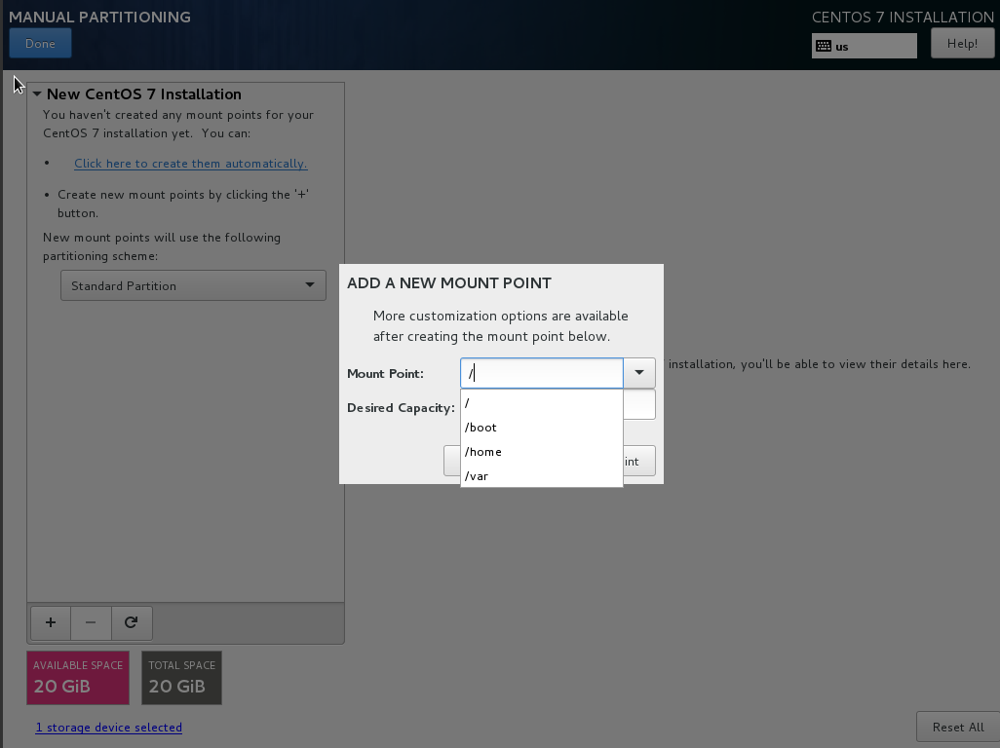
23. Set "File System" to "ext4", and then click "Done":

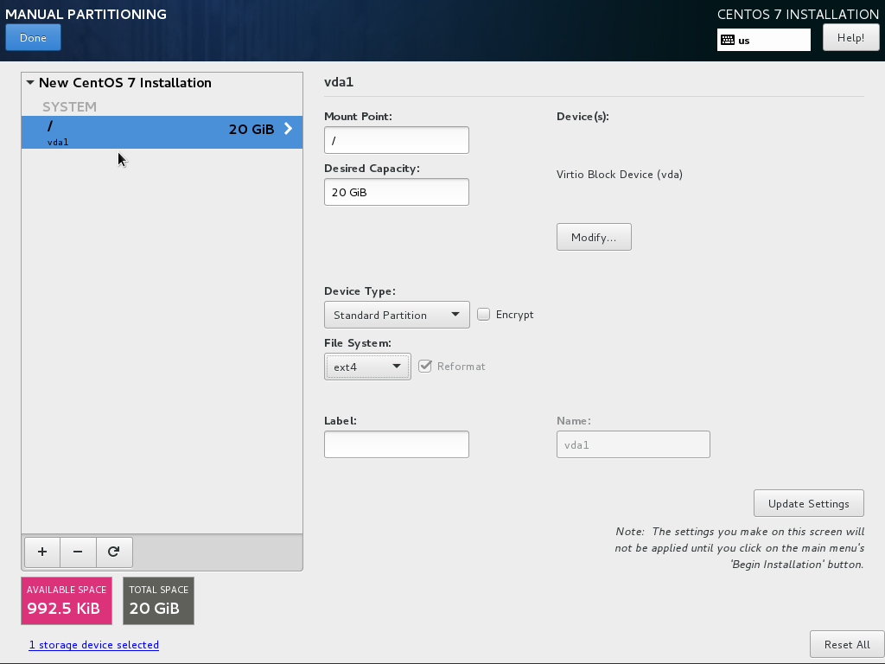
24. A yellow warning bar will appear. Click "Done" again, and then click on "Accept Changes":

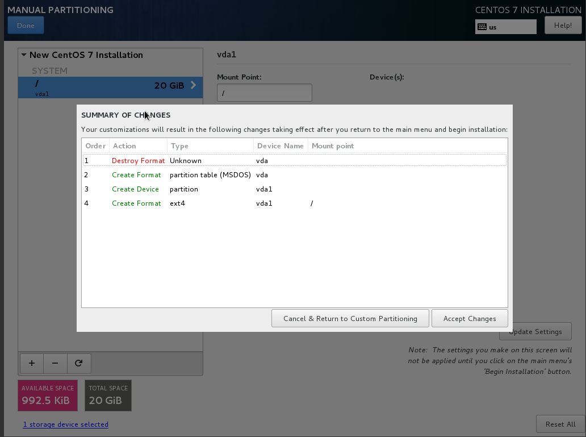
25. Click "Begin installation". Click on "Root Password" and set a good password.
26. Once installation is complete, click "Reboot".
27. The server will be attempting to boot from the ISO once more. Press any key to stop the countdown.
28. In the left-hand menu, under "Project" and then "Compute", click on "Instances". Select the "centos7-kvm-build" instance, and then click on "Terminate Instances". Click "Terminate Instances" to confirm:

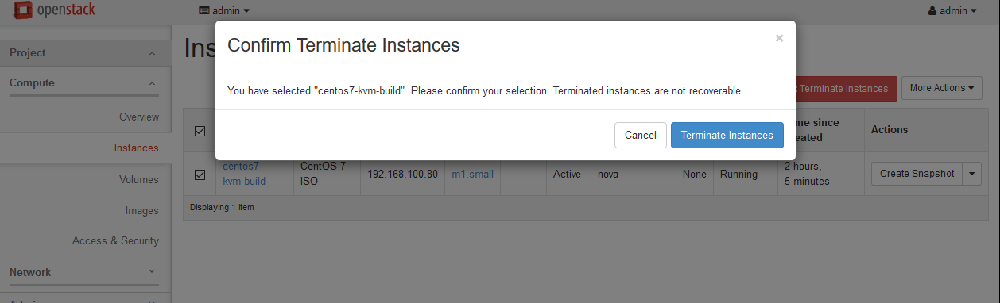
29. In the left-hand menu, under "Project" and then "Compute", click on Volumes.
30. Click on the "Actions" drop-down next to "centos7-kvm-build", and click on "Upload to Image". Name the image "``centos7-kvm-initialkick``", and set the "Disk Format" to "``QCOW2``". Upload the image:

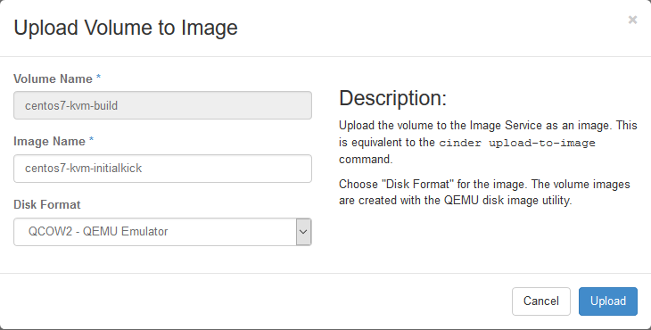
31. The volume will go to "Uploading" state. Wait for this to return to "Available" state.
32. In the left-hand menu, under "Project" and then "Compute", click on "Images". Click on the "centos7-kvm-initialkick" image, which should be in "Active" state.
33. In the top-right drop-down, click on "Update Metadata".
34. On the left-hand side, in the "custom" box, enter "``hypervisor_type``" and click on the + button.
35. On the right-hand side, in the "hypervisor_type" box, enter "``kvm``".
36. On the left-hand side, in the "custom" box, enter "``auto_disk_config``", and click on the + button.
37. On the right-hand side, in the "auto_disk_config" box, enter "``true``".
38. On the left-hand side, in the "custom" box, enter "``hw_qemu_guest_agent``" and click on the + button.
39. On the right-hand side, in the "hw_qemu_guest_agent" box, enter "``true``", and click on the "Save" button:

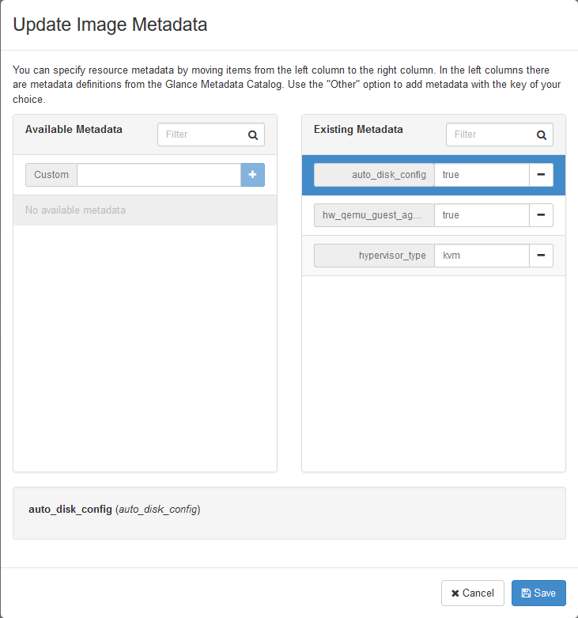
40. In the left-hand menu, under "Project", and then "Compute", click on "Volumes". Highlight the "centos7-kvm-build" volume, and click on "Delete Volumes". Click "Delete Volumes" to confirm:

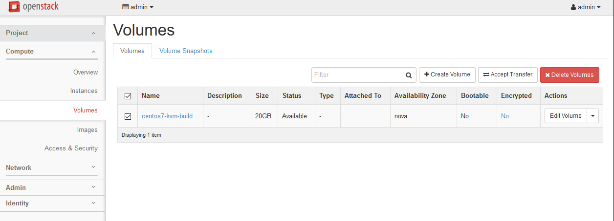
41. In the left-hand menu, under "Project" and then "Compute", click on "Instances".
42. Click on "Launch Instance". Give the instance the name "``centos7-kvm-build``", use the flavor m1.small (for a 20GB disk), and select "Boot from image" and the "centos7-kvm-initialkick" image. Launch the instance:

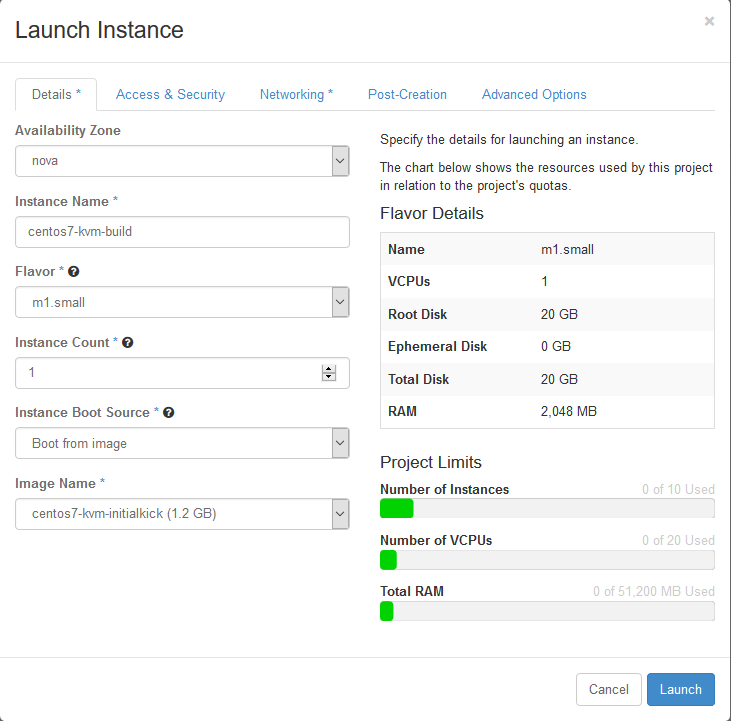
43. Wait for the instance to enter "Active" state. SSH to the new instance as "root", using the root password used during setup.
44. Delete the static hostname file::

     # rm /etc/hostname
45. Stop and disable the firewalld::

     # systemctl disable firewalld.service
     # systemctl stop firewalld.service
46. Disable SELINUX::

     # setenforce 0
     # vim /etc/sysconfig/selinux

       SELINUX=permissive
47. Update all packages on the instance::

     # yum update
48. Install the qemu guest agent, cloud-init and cloud-utils::

     # yum install qemu-guest-agent cloud-init cloud-utils
49. Enable and start the qemu-guest-agent service::

     # systemctl enable qemu-guest-agent.service
     # systemctl start qemu-guest-agent.service
50. Enable kernel console logging::

     # vim /etc/sysconfig/grub

* Append "``console=ttyS0 console=tty0``" to the end of the ``GRUB_CMDLINE_LINUX`` setting. For example::

   GRUB_CMDLINE_LINUX="crashkernel=auto rhgb quiet console=ttyS0 console=tty0"

51. Rebuild the grub config file::

     # grub2-mkconfig -o /boot/grub2/grub.cfg
52. Disable user creation at instance creation time::

     # vim /etc/cloud/cloud.cfg

       disable_root: 0
* Also delete the "``default_user:``" section under "``system_info``".

53. Delete the static network configuration file::

     # /etc/sysconfig/network-scripts/ifcfg-eth0
54. Clear the root bash history::

     # rm /root/.bash_history; history -c
55. In horizon, click the "Create Snapshot" button next to the Instance. Name the image "``CentOS 7 (KVM)``"::

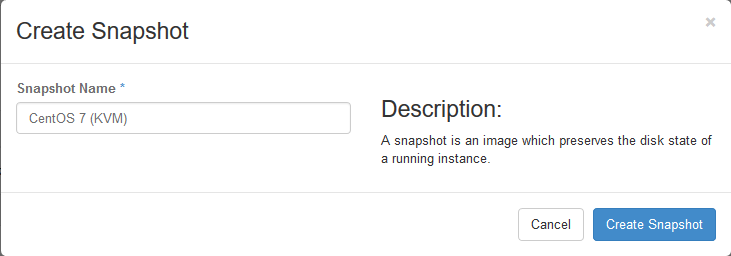
56. Wait for the image to go to "Active" state and then, in the drop-down box next to the image, click on "Edit Image".
57. Check the "public" and "protected" boxes, and click on "Update Image":

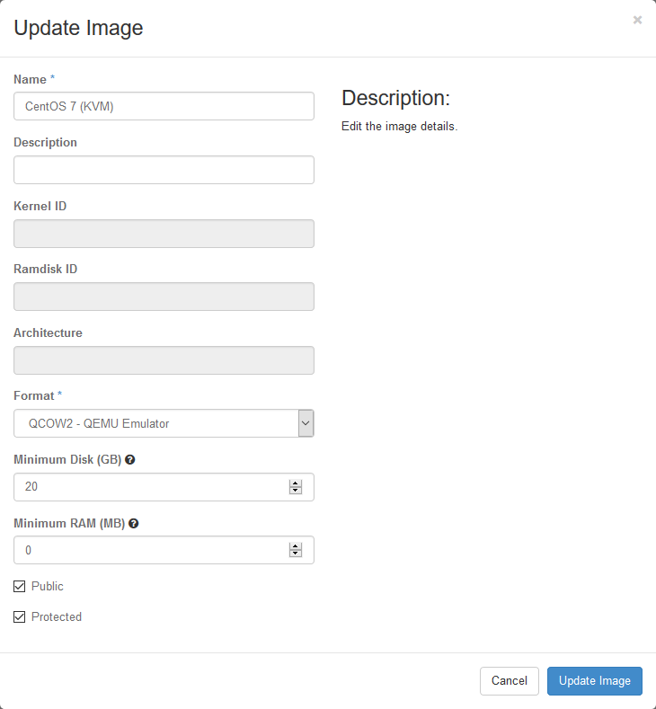
58. Select the "centos7-kvm-initialkick" image, and click on "Delete Images". Click "Delete Images" to confirm:

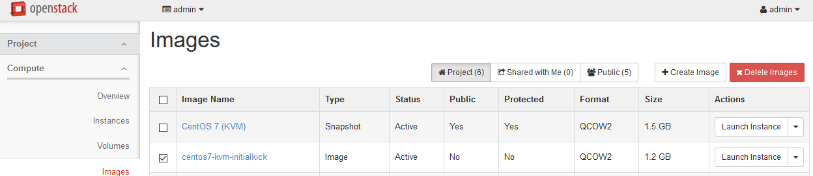
59. In the left-hand menu, under "Project" and then "Compute", click on "Instances".
60. Highlight the "centos7-kvm-build" instance, and click on "Terminate Instances".  Click "Terminate Instances" to confirm:

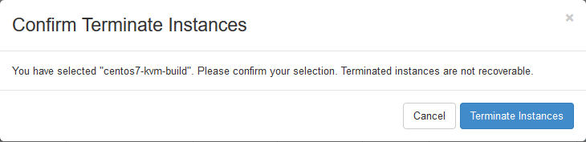
61. In the left-hand menu, under "Admin" and then "System" click on "Hypervisors". Next to "compute1-vm", click on "Enable Service".
