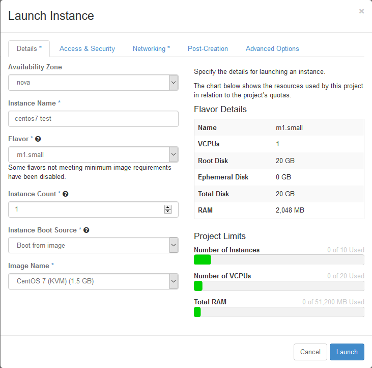
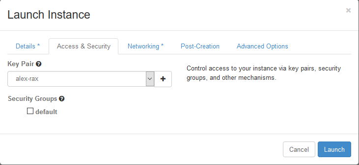
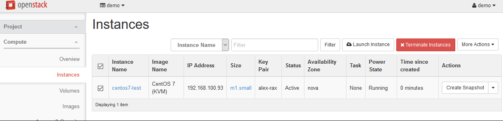

.. highlight:: none

25. Create test KVM CentOS 7 Instance
=====================================

This page is not based on the OpenStack Installation Guide.

1. From a web browser, access http://``*CONTROLLER_ADDRESS*``/dashboard.
2. Log in using the demo credentials.
3. In the left-hand menu, under "Project", and then "Compute", click on "Instances".
4. Click on "Launch Instance". Name the instance "``centos7-test``", select the "m1.small" flavor, and "boot from image". Choose the "CentOS 7 (Xen)" image. Before clicking on "Launch", click on the "Access & Security" tab:

5. Ensure that the key pair you just created or imported on page 23 is selected, and then click on Launch:

6. Wait for the instance to go to "Active" state, and then SSH to the server as "root", using the key pair you previously created or imported.
7. When you are satisfied that the test instance is working, select it and then click on "Terminate Instances". Click on "Terminate Instances" to confirm:

